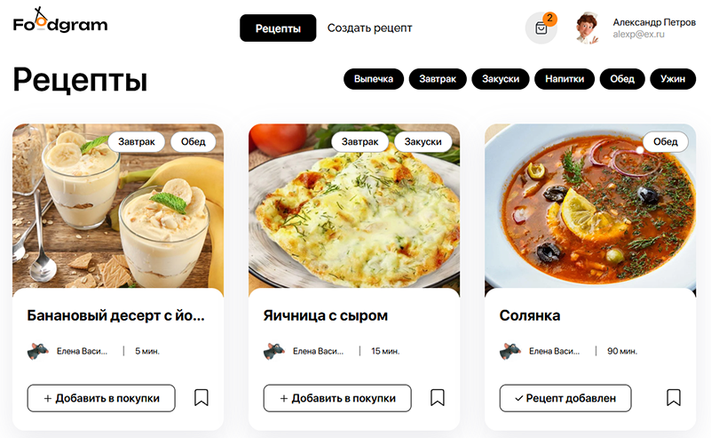

<a href="http://food-gram.hopto.org" target="_blank" rel="noopener noreferrer">
  
</a>

[](https://www.djangoproject.com/)
[](https://reactjs.org/)
[](https://www.postgresql.org/)
[](https://www.docker.com/)

[](https://github.com/KuznetcovIvan/foodgram/actions/workflows/main.yml)

Это веб-платформа, где пользователи могут создавать, хранить и делиться кулинарными рецептами. Проект разработан в рамках обучения и включает полный функционал для удобного ведения базы рецептов, списка покупок и избранных блюд.

---

---

## Возможности

### Для всех пользователей
- Просмотр главной страницы с рецептами
- Просмотр отдельных страниц рецептов
- Просмотр профилей пользователей
- Фильтрация рецептов по тегам
- Постраничная навигация (пагинация)

### Для авторизованных пользователей
#### Работа с рецептами
- Создание собственных рецептов
- Редактирование и удаление своих рецептов
- Добавление рецептов в избранное
- Добавление рецептов в список покупок

#### Подписки
- Подписка на авторов
- Просмотр страницы "Мои подписки"
- Отписка от авторов

#### Список покупок
- Добавление/удаление рецептов в список покупок
- Скачивание списка необходимых ингредиентов в текстовом формате
- Автоматическое суммирование одинаковых ингредиентов в списке

#### Личный кабинет
- Изменение пароля
- Изменение/удаление изображения профиля
- Выход из системы

### Для администраторов
- Управление всеми моделями через админ-панель
- Поиск пользователей по имени и email
- Поиск рецептов по названию и автору
- Фильтрация рецептов по тегам
- Просмотр статистики добавления рецептов в избранное
- Поиск ингредиентов по названию

---

## Технологический стек
- **Backend**: Python, Django, Django REST Framework  
- **База данных**: PostgreSQL (продакшен), SQLite (локально)  
- **Frontend**: React  
- **Контейнеризация**: Docker, Docker Compose  
- **CI/CD**: GitHub Actions, Docker Hub  

---

## Развёртывание проекта локально

1. Клонируйте репозиторий

`git clone https://github.com/kuznetcovivan/foodgramm.git`

2. Перейдите в директорию проекта

`cd foodgramm`

3. Настройте переменные окружения

 Создайте файл `.env` в корне проекта со следующим содержимым:
```
POSTGRES_USER=foodgram_user
POSTGRES_PASSWORD=foodgram_password
POSTGRES_DB=foodgram
DB_HOST=db
DB_PORT=5432
SECRET_KEY=  # Input-your-secret-key-here
DEBUG=False
ALLOWED_HOSTS=localhost 127.0.0.1  # Input-your-domain-name-here
DB_TYPE=postgres
```

4. Запустите приложение

- Запустите контейнеры

`sudo docker compose -f docker-compose.production.yml up -d`

- Выполните миграций

`sudo docker compose -f docker-compose.production.yml exec backend python manage.py migrate`

- Соберите статические файлы

`sudo docker compose -f docker-compose.production.yml exec backend python manage.py collectstatic`

- Скопируйте статические файлы в volume

`sudo docker compose -f docker-compose.production.yml exec backend cp -r /app/collected_static/. /backend_static/static/`

- Импортируйте продукты из json-фикстур

`sudo docker compose -f docker-compose.production.yml exec backend python manage.py import_ingredients`

- Импортируйте теги из json-фикстур

`sudo docker compose -f docker-compose.production.yml exec backend python manage.py import_tags`

- Создайте суперпользователя 

`sudo docker compose -f docker-compose.production.yml exec backend python manage.py createsuperuser`

5. Вам доступно:
- [Веб-интерфейс](http://localhost:9090)
- [Панель администратора](http://localhost:9090/admin/)
- [Документация API](http://localhost:9090/api/docs/)

6. Управление контейнерами
- Для остановки контейнеров

`docker-compose -f docker-compose.production.yml down`

- Для перезапуска контейнеров

`docker-compose -f docker-compose.production.yml restart`

- Для просмотр логов

`docker-compose -f docker-compose.production.yml logs -f`

---

### Если порт 9090 уже занят
Измените порт в файле `docker-compose.production.yml`:
```yaml
gateway:
  ports:
    - 8080:80  # или любой другой свободный порт
```
---
### Автор: [Иван Кузнецов](https://github.com/KuznetcovIvan)
